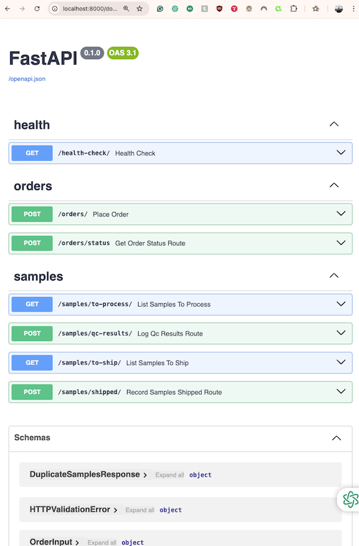

# Elegen API

This project is built using Docker Compose and FastAPI.

## Prerequisites

- Docker
- Docker Compose

## Getting Started

1. Clone the repository:
  ```sh
  git clone https://github.com/yourusername/elegen_api.git
  cd elegen_api
  ```

2. Build and start the Docker containers:
  ```sh
  docker-compose up --build
  ```

3. The API will be available at `http://localhost:8000`.

## Accessing API Documentation

FastAPI provides interactive API documentation. You can access it at the following URLs once the server is running:

- **Swagger UI**: `http://localhost:8000/docs`
- **ReDoc**: `http://localhost:8000/redoc`

## Available Endpoints

- **POST /orders**: Place a new order
- **GET /samples/to-process**: List orders to process
- **POST /samples/qc-results**: Log QC results of processed orders
- **GET /samples/to-ship**: List samples that should be shipped
- **POST /samples/shipped**: Record samples as shipped
- **POST /orders/status**: Report sample statuses in order (Stretch Goal)

## Project Structure

```
app/
├── routes/
│   ├── __init__.py
│   ├── orders.py
│   ├── samples.py
│   └── health.py
├── schemas/
│   ├── __init__.py
│   └── pydantic_models.py
├── services/
│   ├── __init__.py
│   ├── order_service.py
│   └── sample_service.py
├── db.py
├── models.py (SQLModel models)
└── main.py
```

## Screenshots


*API Docs*


*UML*


